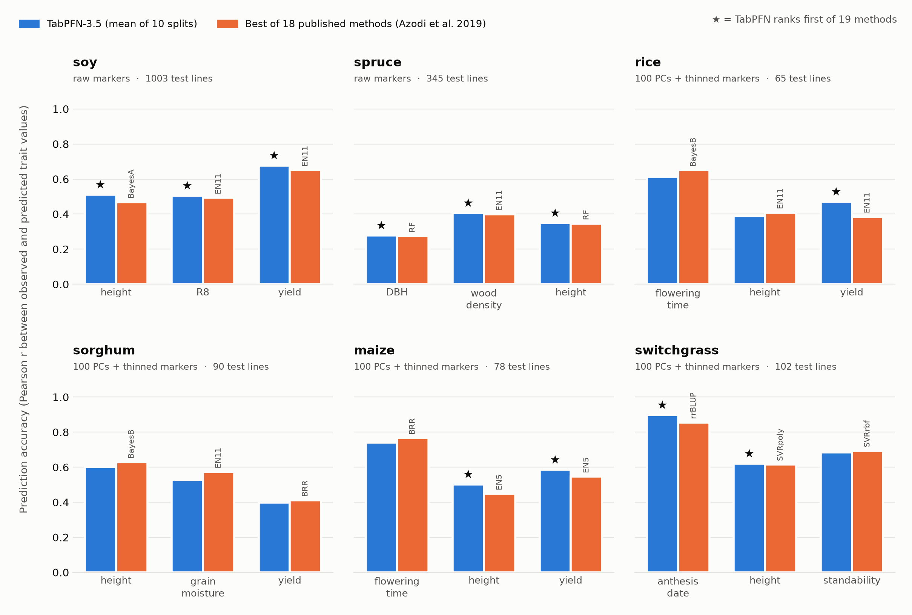

# Tabular genomic prediction with TabPFN-3.5

An entry to the Prior Labs TabPFN-3.5 Hackathon (2026): predicting plant traits from genetic
markers by treating genomic prediction as a plain tabular regression problem, benchmarked
against 18 established methods on six crop and tree species.

## Genomic Prediction

**Genomic prediction** is widely used in modern plant and animal breeding to predict an individual's phenotypic performance (traits like yield, disease resistance, growth rate, milk production, or meat quality) from its genetic markers (genomic DNA sequence information). A model is trained on individuals with both genotype and phenotype data, then used to predict the performance of new individuals from genotype alone.

Genomic prediction is valuable because genotyping is extremely fast and inexpensive relative to phenotyping. Breeders can screen thousands or millions of individuals genetically and select the most promising ones without having to phenotype, enabling earlier identification of elite individuals and accelerating breeding progress.

Genomic prediction has been used for roughly 20 years and is now foundational to breeding programs in maize, soybean, wheat, cattle, pigs, chickens, and many other crops and livestock we all depend on. It underpins breeding industries worth billions of dollars, with genomic selection in U.S. dairy cattle alone estimated to have returned about $4 billion since its adoption in 2009 ([Rexroad et al. 2019](https://doi.org/10.3389/fgene.2019.00327)). Because genetic gains accumulate across generations, even modest improvements in selection accuracy can translate into substantial additional economic gains over the course of a breeding program. This makes genomic prediction an especially valuable target for developing better prediction methods.

### Why TabPFN and why now?

A typical genomic prediction dataset consists of an $N \times M$ matrix of genetic markers and an $N \times P$ matrix of phenotypic measurements, potentially accompanied by covariates. In the simplest formulation, this is a **supervised learning problem**. Individuals with known genotypes and phenotypes are used to learn a mapping from genotype to phenotype, which is then used to predict phenotypes for individuals whose phenotypes have not yet been observed.

The dimensionality is unusual compared with many conventional tabular problems. A dataset might contain 1,000 samples (individuals) and 20,000 features (genetic markers), resulting in 20 million genotype measurements but only 1,000 labeled examples. In other words, genomic prediction often has very large numbers of features relative to the number of individuals.

Numerous specialized methods exist for genomic prediction, including mixed models, Bayesian models, kernel methods, and machine learning approaches. Most are designed around genetic relationships, marker effects, or assumptions about how genetic variation affects phenotypes rather than treating the problem as generic tabular learning. [The Bitter Lesson](http://www.incompleteideas.net/IncIdeas/BitterLesson.html) suggests that there may be value in taking the opposite approach, abandon domain-specific assumptions and let compute and increasingly capable general-purpose learning systems do the heavy lifting.

Here we take that Bitter Lesson approach. **We treat genomic prediction as a tabular regression problem and feed raw genetic marker data straight into TabPFN-3.5**, with no human curation of markers, no assumptions about how genes affect traits, and no tuning. TabPFN has appeared in genomic prediction before, as one component of a larger ensemble trained on a small set of markers hand-picked using prior genetic knowledge ([TRXB, 2025](https://link.springer.com/article/10.1007/s44412-025-00005-3)). We go the other way. As Sutton puts it, "we want AI agents that can discover like we can, not which contain what we have discovered." To our knowledge, this is the first benchmark of TabPFN learning genomic prediction directly from raw marker data, free of human curation.

This is particularly interesting because we have strong biological reason to expect non-linear effects and interactions between genetic variants. TabPFN's in-context learning and ability to model complex relationships offer a way to capture these patterns without explicitly specifying a genetic architecture. More broadly, TabPFN makes it possible to approach genomic prediction with little dataset-specific model selection or hyperparameter tuning.

Recent improvements in TabPFN's input capacity make this approach substantially more practical. TabPFN-3.5 accepts up to **20,000 features**, 10× more than earlier versions, which is enough to use raw marker data for many genomic datasets. This is an important unlock for genomic data, where tens of thousands of genetic markers per individual are common.

The central question is simple:

> **How well can a general-purpose tabular foundation model perform on genomic prediction, without the specialized machinery traditionally built around this problem?**

## Results

We benchmarked TabPFN-3.5 on the six-species, 18-trait dataset of
[Azodi et al. (2019)](https://doi.org/10.1534/g3.119.400498), who compared 18 established genomic
prediction methods: mixed models (rrBLUP), Bayesian regressions (BayesA, BayesB, Bayesian LASSO,
Bayesian ridge regression), elastic nets, support vector machines, random forests, gradient
boosting and neural networks. For each trait we ran TabPFN on 10 random 80/20 splits of the lines
and report the mean prediction accuracy: the Pearson correlation between predicted and observed
trait values in the held-out 20%, the same measure the paper uses.

**TabPFN-3.5 is the best of all 19 methods on 11 of the 18 traits**, and in the top three on 12.
Ranking all 19 methods on every trait, TabPFN's median rank is 1. The next best is the paper's
own overall winner, an elastic net (EN11), at 3.5:

| Method | Median rank (of 19) | Traits where best |
|---|---|---|
| **TabPFN-3.5** | **1** | **11** |
| EN11 (elastic net) | 3.5 | 2 |
| BayesA | 5 | 0 |
| EN5 (elastic net) | 5.5 | 0 |
| BRR (Bayesian ridge regression) | 6 | 2 |
| rrBLUP (the standard mixed model) | 6 | 0 |

TabPFN does best where it can see every marker. Soy (4,234 markers) and spruce (6,930) fit
within TabPFN-3.5's 20,000-feature limit, and there TabPFN ranks first on all 6 traits. On soy,
the dataset with the largest test sets (1,003 lines), it improves on the best published method by
2.5–9% (relative). The other four species have 56,000–245,000 markers, so we give TabPFN a compact
version: the top 100 principal components of all markers (a genome-wide summary of how related
the lines are), plus 19,900 raw markers spaced evenly along the genome. There TabPFN ranks first
on 5 of 12 traits; where it falls short, the gap is mostly within the noise of these small test
sets (65–102 lines). Per-trait numbers are in
[`results/summary_table.csv`](results/summary_table.csv).

A note on comparability: Azodi et al. did not publish their exact train/test splits, so our
splits are different random 80/20 splits of the same lines. As a check, we re-ran rrBLUP on our
splits for soy and spruce. It lands within 0.003–0.010 of the published rrBLUP on five of six
traits (spruce wood density is the exception, at +0.039), so our splits are comparable to theirs.
On identical splits, TabPFN beats rrBLUP on 30 of 30 soy splits.

For the data and how to get it, see [`data/README.md`](data/README.md).

## License

The code in this repository is Apache-2.0 (see [`LICENSE`](LICENSE)). It does not include the
TabPFN-3.5 model weights, which TabPFN downloads on first use and which are licensed by Prior Labs
GmbH under the [TabPFN-3.5 Non-Commercial License](https://huggingface.co/Prior-Labs/tabpfn_3_5/blob/main/LICENSE):
research and evaluation use is free, while commercial or production use needs a license from Prior Labs.
